# FireflyTX Architecture Guide

> **📚 Learning Path:** This guide uses progressive disclosure - start with the overview, then dive deeper into specific components as needed.

**Last Updated:** 2025-10-19

---

## Table of Contents

1. [System Overview](#system-overview)
2. [Core Architecture Principles](#core-architecture-principles)
3. [Component Deep Dive](#core-components)
4. [Data Flow & Execution](#data-flow)
5. [Integration Patterns](#integration-patterns)
6. [Performance & Scalability](#performance-characteristics)
7. [Security Considerations](#security-considerations)
8. [Platform Compatibility](#platform-compatibility)

---

## System Overview

### What is FireflyTX?

**FireflyTX is a Python wrapper that provides a seamless interface for defining SAGA and TCC transactions in Python while executing them through the enterprise-grade lib-transactional-engine Java library.**

Think of it as a **translator and orchestrator**:
- **You speak Python** (define your business logic with decorators)
- **FireflyTX translates** (converts Python definitions to Java-compatible configuration)
- **Java executes** (handles all the complex distributed transaction orchestration)

### Why This Architecture?

| Challenge | Traditional Approach | FireflyTX Approach |
|-----------|---------------------|-------------------|
| **Complexity** | Implement SAGA/TCC from scratch | Use battle-tested Java engine |
| **Reliability** | Build retry, compensation, recovery | Get enterprise features out-of-the-box |
| **Developer Experience** | Learn Java frameworks | Write simple Python decorators |
| **Performance** | Python-only limitations | Leverage JVM performance |
| **Maintenance** | Maintain transaction engine | Focus on business logic |

---

## Core Architecture Principles

### 1. 🐍 Python-First Development

**What it means:** Developers work exclusively in Python, using familiar patterns and tools.

```python
# This is all you write - simple, clean Python
@saga("payment-processing")
class PaymentSaga:
    @saga_step("validate", retry=3)
    async def validate_payment(self, amount: float):
        return {"validated": True, "amount": amount}
```

**Benefits:**
- No Java knowledge required
- Full Python ecosystem (asyncio, type hints, testing frameworks)
- Rapid development and iteration
- Easy debugging with Python tools

### 2. ☕ Java-Powered Execution

**What it means:** All transaction orchestration runs in a separate Java process using lib-transactional-engine.

**What Java handles:**
- Transaction state management
- Retry logic with exponential backoff
- Compensation orchestration
- Persistence and recovery
- Event publishing
- Distributed tracing
- Performance optimization

**Benefits:**
- Battle-tested reliability (lib-transactional-engine is production-proven)
- JVM performance characteristics
- Enterprise-grade features
- Continuous improvements from Java library updates

### 3. 🌉 Transparent Bridge

**What it means:** Communication between Python and Java is automatic and invisible to developers.

**How it works:**
1. **Subprocess Management:** Python starts Java as a child process
2. **JSON IPC:** Request/response communication via JSON files
3. **HTTP Callbacks:** Java calls Python methods via HTTP
4. **Log Streaming:** Java logs appear in Python logging

**Benefits:**
- No manual process management
- Automatic JAR downloading and building
- Unified logging and monitoring
- Cross-platform compatibility

### 4. 🔄 Zero-Config Java

**What it means:** Java runtime is managed automatically - no manual setup required.

**Automatic handling:**
- JAR discovery and download from GitHub
- Maven build if needed
- Classpath configuration
- JVM startup and shutdown
- Version compatibility checks

**Benefits:**
- `pip install fireflytx` is all you need
- No Java expertise required
- Consistent behavior across environments
- Automatic updates

---

## High-Level Architecture Diagram

```
┌─────────────────────────────────────────────────────────────────────────┐
│                         Your Python Application                         │
│                                                                         │
│  @saga("order-processing")                                              │
│  class OrderSaga:                                                       │
│      @saga_step("validate")                                             │
│      async def validate_order(self, data): ...                          │
└────────────────────────────┬────────────────────────────────────────────┘
                             │
                             ▼
┌─────────────────────────────────────────────────────────────────────────┐
│                    FireflyTX Python Wrapper                             │
│                                                                         │
│  ┌──────────────┐  ┌──────────────┐  ┌──────────────┐                   │
│  │  Decorators  │  │   Engines    │  │  Callbacks   │                   │
│  │  @saga       │→ │  SagaEngine  │→ │  HTTP Server │                   │
│  │  @saga_step  │  │  TccEngine   │  │  Registry    │                   │
│  └──────────────┘  └──────────────┘  └──────────────┘                   │
│                             │                ▲                          │
│                             ▼                │                          │
│                    ┌──────────────────┐      │                          │
│                    │  Subprocess      │      │                          │
│                    │  Bridge          │      │                          │
│                    │  • JSON IPC      │      │                          │
│                    │  • JAR Manager   │      │                          │
│                    └──────────────────┘      │                          │
└────────────────────────────┬─────────────────┼──────────────────────────┘
                             │                 │
                             ▼                 │
┌──────────────────────────────────────────────┼──────────────────────────┐
│                    Java Process (Separate JVM)                          │
│                                              │                          │
│  ┌────────────────────────────────────────┐  │                          │
│  │  lib-transactional-engine              │  │                          │
│  │  • SagaEngine / TccEngine              │  │                          │
│  │  • Orchestration Logic                 │  │                          │
│  │  • Retry & Timeout Management          │  │                          │
│  │  • Compensation Coordination           │  │                          │
│  └────────────────────────────────────────┘  │                          │
│                     │                        │                          │
│                     ▼                        │                          │
│  ┌────────────────────────────────────────┐  │                          │
│  │  JavaSubprocessBridge                  │  │                          │
│  │  • Receives JSON requests              │  │                          │
│  │  • Calls engine methods                │──┘                          │
│  │  • HTTP callbacks to Python            │──────────────────────┐      │
│  └────────────────────────────────────────┘                      │      │
│                                                                  │      │
│  ┌────────────────────────────────────────┐                      │      │
│  │  Spring Boot + Reactor                 │                      │      │
│  │  • Event Publishing (Kafka)            │                      │      │
│  │  • Persistence (Redis/DB)              │                      │      │
│  │  • Distributed Tracing                 │                      │      │
│  └────────────────────────────────────────┘                      │      │
└──────────────────────────────────────────────────────────────────┼──────┘
                                                                   │
                                                                   │
                    ┌──────────────────────────────────────────────┘
                    │
                    ▼
            ┌───────────────┐
            │ Python Method │
            │ Execution     │
            │ (Your Code)   │
            └───────────────┘
```

### Architecture Flow Explanation

1. **Definition Phase (Python):**
   - You write SAGA/TCC classes with decorators
   - Decorators capture metadata (steps, dependencies, retry policies)

2. **Registration Phase (Python → Java):**
   - Python engine extracts decorator metadata
   - Generates Java-compatible configuration (JSON)
   - Sends to Java via subprocess bridge

3. **Execution Phase (Java orchestrates, Python executes):**
   - Java engine orchestrates the transaction flow
   - For each step, Java makes HTTP callback to Python
   - Python executes your business logic method
   - Returns result to Java
   - Java continues orchestration

4. **Completion Phase (Java → Python):**
   - Java returns final result (success/failure)
   - Python maps to `SagaResult` or `TccResult`
   - Your application receives the result

---

## Detailed Component Diagram

```mermaid
graph TB
    Python["📱 Python Application<br/>• SAGA/TCC Classes<br/>• Python Decorators<br/>• Async/Await Logic"]

    subgraph "🐍 FireflyTX Python Wrapper"
        Decorators["🎨 Decorator Layer<br/>@saga, @tcc_participant<br/>@saga_step, @try_method"]
        Engines["⚙️ Engine Layer<br/>SagaEngine, TccEngine<br/>execute_by_class()"]
        Bridge["🌉 Subprocess Bridge<br/>JAR Auto-Download<br/>Process Management<br/>IPC Communication"]
        CLI["🖥️ CLI Tools<br/>jar-info, java-logs<br/>visualize, test"]
    end

    subgraph "☕ Java Process (Separate JVM)"
        LibEngine["📚 lib-transactional-engine<br/>• Real Transaction Logic<br/>• Persistence & Recovery<br/>• Enterprise Features"]
        JavaRuntime["🔧 Java Runtime<br/>• Spring Boot<br/>• Reactor Core<br/>• Built from GitHub"]
    end

    Python --> Decorators
    Python --> Engines
    Decorators --> Engines
    Engines --> Bridge
    Bridge -.->|"🔄 IPC Calls"| LibEngine
    LibEngine -.->|"📊 Results"| Bridge
    LibEngine --> JavaRuntime
    CLI --> Bridge

    classDef pythonLayer fill:#3776ab,stroke:#ffffff,color:#ffffff
    classDef javaLayer fill:#f89820,stroke:#ffffff,color:#ffffff
    classDef bridgeLayer fill:#28a745,stroke:#ffffff,color:#ffffff

    class Python,Decorators,Engines,CLI pythonLayer
    class LibEngine,JavaRuntime javaLayer
    class Bridge bridgeLayer
```



---

## Core Components

> **💡 Tip:** Each component has a specific responsibility. Understanding these layers helps you know where to look when debugging or extending functionality.

### Component Overview

| Layer | Components | Responsibility | You Interact With? |
|-------|-----------|----------------|-------------------|
| **User API** | Decorators, High-level API | Define transactions | ✅ Yes - Always |
| **Engine** | SagaEngine, TccEngine | Orchestrate execution | ✅ Yes - Often |
| **Integration** | Subprocess Bridge, Callbacks | Python ↔ Java communication | ⚠️ Rarely - Advanced use |
| **Infrastructure** | Events, Persistence, Logging | Observability & state | ✅ Yes - Configuration |
| **Java Runtime** | lib-transactional-engine | Transaction execution | ❌ No - Automatic |

---

### 1. Decorator Layer (Your Entry Point)

**Purpose:** Provide a declarative API for defining distributed transactions.

**What you use:**

```python
from fireflytx import saga, saga_step, compensation_step
from fireflytx import tcc, tcc_participant, try_method, confirm_method, cancel_method
```

**How it works:**

1. **Metadata Capture:** Decorators collect information about your transaction structure
2. **Validation:** Ensures your definitions are valid (dependencies exist, no cycles)
3. **Registration:** Stores metadata for engine consumption

**Example - SAGA:**

```python
@saga("payment-processing")  # ← Marks class as a SAGA transaction
class PaymentSaga:
    @saga_step("validate", retry=3, timeout_ms=5000)  # ← Defines a step
    async def validate_payment(self, data):
        return {"validated": True}

    @compensation_step("validate")  # ← Links compensation to step
    async def undo_validation(self, data):
        return {"undone": True}
```

**Example - TCC:**

```python
@tcc("order-fulfillment")  # ← Marks class as a TCC transaction
class OrderTcc:
    @tcc_participant("payment", order=1)  # ← Defines participant with ordering
    class PaymentParticipant:
        @try_method(timeout_ms=10000)  # ← Try phase
        async def reserve_payment(self, order): ...

        @confirm_method()  # ← Confirm phase
        async def confirm_payment(self, reservation): ...

        @cancel_method()  # ← Cancel phase
        async def cancel_payment(self, reservation): ...
```

**Key Features:**
- Type-safe with full IDE support
- Automatic validation of dependencies
- Support for both sync and async methods
- Rich configuration options (retry, timeout, events)

---

### 2. Engine Layer (Orchestration)

**Purpose:** Coordinate transaction execution between Python and Java.

#### SagaEngine

**Responsibilities:**
- Register SAGA definitions with Java engine
- Start HTTP callback server for Python methods
- Execute SAGAs via Java orchestration
- Map Java results to Python objects

**Key Methods:**

```python
from fireflytx import SagaEngine
from fireflytx.decorators.saga import saga, saga_step

@saga("payment-processing")
class PaymentSaga:
    @saga_step("validate")
    async def validate_payment(self, payment_data):
        return {"validated": True}

# Create and initialize engine
engine = SagaEngine()
await engine.initialize()

# Execute SAGA by class
result = await engine.execute(
    PaymentSaga,
    {"amount": 100.0}
)

# Check results
if result.is_success:
    print(f"Completed in {result.duration_ms}ms")
else:
    print(f"Failed: {result.error}")
    print(f"Compensated: {result.compensated_steps}")

# Shutdown engine
await engine.shutdown()
```

**Features:**
- Asynchronous step execution with dependency resolution
- Automatic compensation on failure (reverse order)
- Configurable retry and timeout policies
- Event publishing for observability
- Persistent state management

#### TccEngine

**Responsibilities:**
- Register TCC definitions with Java engine
- Coordinate two-phase commit protocol
- Manage participant ordering and execution
- Handle resource reservation and cleanup

**Key Methods:**

```python
from fireflytx import TccEngine
from fireflytx.decorators.tcc import tcc, tcc_participant, try_method, confirm_method, cancel_method

@tcc("order-processing")
class OrderTcc:
    @tcc_participant("payment", order=1)
    class PaymentParticipant:
        @try_method
        async def try_payment(self, order_data):
            return {"reserved": True}

        @confirm_method
        async def confirm_payment(self, reservation):
            pass

        @cancel_method
        async def cancel_payment(self, reservation):
            pass

# Create and start engine
engine = TccEngine()
engine.start()

# Execute TCC transaction
result = engine.execute(
    OrderTcc,
    {"order_id": "ORD-123"}
)

# Check result
if result.is_confirmed:
    print("TCC confirmed successfully")
elif result.is_canceled:
    print("TCC canceled")

# Stop engine
engine.stop()
```

**Features:**
- Two-phase commit coordination (Try → Confirm/Cancel)
- Participant ordering and execution
- Resource reservation and cleanup
- Strong consistency guarantees
- Automatic rollback on Try phase failure

**When to use which?**

| Use Case | Pattern | Why? |
|----------|---------|------|
| Eventually consistent workflows | SAGA | Simpler, more flexible, better for long-running processes |
| Strong consistency required | TCC | Two-phase commit ensures atomicity |
| Cross-service orchestration | SAGA | Easier to implement compensations |
| Resource reservation needed | TCC | Try phase reserves, Confirm commits |
| Complex dependency graphs | SAGA | Better support for parallel execution |
| Simple atomic operations | TCC | Clearer semantics for all-or-nothing |

---

### 3. Core Types & Context (Data Structures)

**Purpose:** Provide type-safe data structures for transaction execution.

#### SagaContext / TccContext

**What it is:** A container for sharing data between steps/participants.

**Common Use Cases:**

> **Note:** In the current implementation, context management is handled internally by the Java engine. Step methods receive input data directly and return results. The Java engine manages data flow between steps based on dependencies.

```python
from fireflytx.decorators.saga import saga_step

@saga_step("reserve-inventory")
async def reserve_inventory(self, order_data):
    # Process order data
    reservation_id = f"RES-{order_data['order_id']}"

    # Return result that can be used by dependent steps
    return {
        "reservation_id": reservation_id,
        "items": order_data["items"]
    }

@saga_step("confirm-order", depends_on=["reserve-inventory"])
async def confirm_order(self, order_data):
    # The Java engine provides results from dependent steps
    # in the input data based on the dependency graph

    return {"confirmed": True, "order_id": order_data["order_id"]}
```

**Key Methods:**

| Method | Purpose | Example |
|--------|---------|---------|
| `set_data(key, value)` | Store step data | `context.set_data("user_id", 123)` |
| `get_data(key)` | Retrieve step data | `user_id = context.get_data("user_id")` |
| `put_header(key, value)` | Add header | `context.put_header("correlation_id", "abc")` |
| `get_header(key)` | Get header | `corr_id = context.get_header("correlation_id")` |
| `get_all_data()` | Get all stored data | `all_data = context.get_all_data()` |

**Thread Safety:** Context is thread-safe and can be accessed from multiple steps concurrently.

#### SagaResult / TccResult

**What it is:** The outcome of a transaction execution.

**Structure:**

```python
from fireflytx import SagaResult

result = await engine.execute(MySaga, input_data)

# Check success
if result.is_success:
    print("✅ Transaction succeeded")
else:
    print("❌ Transaction failed")

# Access details
print(f"Duration: {result.duration_ms}ms")
print(f"Correlation ID: {result.correlation_id}")
print(f"Steps executed: {list(result.steps.keys())}")

# On failure
if not result.is_success:
    print(f"Error: {result.error}")
    print(f"Failed step: {result.failed_step}")
    print(f"Compensated steps: {result.compensated_steps}")
```

**Key Attributes:**

| Attribute | Type | Description |
|-----------|------|-------------|
| `is_success` | bool | Whether transaction completed successfully |
| `correlation_id` | str | Unique transaction identifier |
| `duration_ms` | int | Total execution time in milliseconds |
| `steps` | dict | Map of step_id → step result |
| `error` | str | Error message (if failed) |
| `failed_step` | str | ID of step that failed |
| `compensated_steps` | list | Steps that were compensated |
| `context` | dict | Final context data |

---

### 4. Subprocess Bridge Layer (Python ↔ Java Communication)

**Purpose:** Enable seamless communication between Python and Java processes.

**Key Insight:** This is the "magic" that makes "Python defines, Java executes" work. You rarely interact with it directly, but understanding it helps with debugging.

#### How It Works

```
┌────────────────────────────────────────────────────────────┐
│ Python Process                                             │
│                                                            │
│  ┌────────────────────────────────────────────────────┐    │
│  │ JavaSubprocessBridge (Python)                      │    │
│  │                                                    │    │
│  │  1. start_jvm()                                    │    │
│  │     • Download/build JAR if needed                 │    │
│  │     • Start Java subprocess                        │    │
│  │     • Create temp directories for IPC              │    │
│  │                                                    │    │
│  │  2. call_java_method(request)                      │    │
│  │     • Write JSON request to temp file              │    │
│  │     • Wait for response file                       │    │
│  │     • Parse and return result                      │    │
│  │                                                    │    │
│  │  3. Stream logs                                    │    │
│  │     • Capture Java stdout/stderr                   │    │
│  │     • Emit to Python logging                       │    │
│  └────────────────────────────────────────────────────┘    │
│                           │                                │
│                           │ JSON Files                     │
│                           ▼                                │
└───────────────────────────┼────────────────────────────────┘
                            │
                            │
┌───────────────────────────┼────────────────────────────────┐
│ Java Process              │                                │
│                           ▼                                │
│  ┌────────────────────────────────────────────────────┐    │
│  │ JavaSubprocessBridge (Java)                        │    │
│  │                                                    │    │
│  │  1. Poll for request files                         │    │
│  │  2. Read JSON request                              │    │
│  │  3. Use reflection to call Java method             │    │
│  │  4. Write JSON response                            │    │
│  │  5. Make HTTP callbacks to Python when needed      │    │
│  └────────────────────────────────────────────────────┘    │
│                                                            │
│  ┌────────────────────────────────────────────────────┐    │
│  │ lib-transactional-engine                           │    │
│  │  • SagaEngine / TccEngine                          │    │
│  │  • Orchestration logic                             │    │
│  │  • Persistence, events, retry                      │    │
│  └────────────────────────────────────────────────────┘    │
└────────────────────────────────────────────────────────────┘
```

#### Communication Protocol

**1. JSON IPC (Inter-Process Communication)**

Used for: Method calls from Python to Java

```python
# Python side
request = JavaClassCallRequest(
    class_name="com.firefly.transactional.saga.engine.SagaEngine",
    method_name="executeSaga",
    method_type="instance",
    args=[saga_definition, input_data]
)
response = bridge.call_java_method(request)
```

**2. HTTP Callbacks**

Used for: Method calls from Java to Python (executing your business logic)

```python
# Java calls this endpoint when it needs to execute a Python step
POST http://localhost:8080/callback
{
    "method_type": "step",
    "method_name": "validate_payment",
    "step_id": "validate",
    "input_data": {"amount": 100.0},
    "context_data": {"correlation_id": "abc-123"}
}

# Python callback server executes the method and returns
{
    "success": true,
    "result": {"validated": true},
    "step_id": "validate",
    "method_name": "validate_payment"
}
```

**Key Features:**
- **🌍 Cross-Platform**: Works on Linux, macOS (including Apple Silicon), Windows
- **🔄 Auto JAR Management**: Downloads and builds lib-transactional-engine automatically
- **📡 IPC Communication**: JSON-based inter-process communication
- **🔄 Process Lifecycle**: Automatic Java process management and recovery
- **📊 Logging Bridge**: Real-time Java log streaming to Python
- **⚡ Performance**: Minimal overhead (~1-10ms per call)

**Error Handling:**

Errors are propagated transparently:

```python
try:
    result = await engine.execute(MySaga, data)
except JavaExecutionError as e:
    print(f"Java error: {e.java_exception}")
    print(f"Stack trace: {e.java_stack_trace}")
except TimeoutError:
    print("Java process timed out")
```

**Debugging:**

```python
from fireflytx.utils.java_subprocess_bridge import get_java_bridge

bridge = get_java_bridge()

# View Java logs
logs = bridge.get_java_logs(last_n=100)
for log in logs:
    print(log)

# Follow logs in real-time
bridge.follow_java_logs()  # Streams to console

# Set Java log level
bridge.set_java_log_level("DEBUG")

# Enable log file
bridge.enable_java_log_file("/tmp/java-engine.log")
```

---

### 5. Callback System (Java → Python Method Execution)

**Purpose:** Allow Java to execute your Python business logic methods.

**How It Works:**

1. **Startup:** Python starts an HTTP server on a random port
2. **Registration:** Python tells Java the callback URL
3. **Execution:** When Java needs to run a step, it POSTs to the callback URL
4. **Response:** Python executes the method and returns the result

**Implementation:**

```python
# This happens automatically when you use the engine
from fireflytx.callbacks import PythonCallbackHandler

# Callback handler is created and started
handler = PythonCallbackHandler()
handler.register_saga_instance("my-saga", saga_instance)
handler.start()  # Starts HTTP server

# Java can now call:
# POST http://localhost:{port}/callback
# {
#   "method_type": "step",
#   "method_name": "validate_payment",
#   "step_id": "validate",
#   "input_data": {...},
#   "context_data": {...}
# }
```

**Async Support:**

The callback handler automatically detects and handles async methods:

```python
@saga_step("async-step")
async def my_async_step(self, data):
    await asyncio.sleep(1)  # Async operations work seamlessly
    return {"result": "done"}

@saga_step("sync-step")
def my_sync_step(self, data):
    time.sleep(1)  # Sync operations also work
    return {"result": "done"}
```

**Thread Safety:**

- Each callback runs in its own thread
- Async methods run in a dedicated event loop
- Context is thread-safe for concurrent access

---

### 6. Configuration System

**Purpose:** Translate Python configuration to Java-compatible format.

**Module:** `fireflytx.config.java_config_generator`

**What It Does:**

```python
# You write this (Python)
@saga("payment-processing")
class PaymentSaga:
    @saga_step("validate", retry=3, timeout_ms=5000)
    async def validate_payment(self, data): ...

# Config generator produces this (for Java)
{
    "saga_name": "payment-processing",
    "steps": [
        {
            "step_id": "validate",
            "method_name": "validate_payment",
            "retry_policy": {
                "max_attempts": 3,
                "backoff_ms": 1000
            },
            "timeout_ms": 5000,
            "callback_url": "http://localhost:8080/callback"
        }
    ],
    "event_publisher": {
        "type": "kafka",
        "bootstrap_servers": "localhost:9092"
    },
    "persistence_provider": {
        "type": "redis",
        "host": "localhost",
        "port": 6379
    }
}
```

**Configuration Layers:**

1. **Decorator Metadata:** Extracted from `@saga`, `@saga_step`, etc.
2. **Engine Configuration:** Event publishers, persistence providers
3. **Runtime Configuration:** Timeouts, thread pools, circuit breakers
4. **Java Mapping:** Converts Python types to Java-compatible structures

---

### 7. Event System (Observability)

**Purpose:** Publish events for monitoring, debugging, and integration with external systems.

**Event Flow:**

```
Step Execution → Java Engine → Event Publisher → Kafka/External System
                                                ↓
                                        Your Monitoring/Analytics
```

**Built-in Publishers:**

```python
from fireflytx import NoOpStepEventPublisher, KafkaStepEventPublisher

# Development: No-op publisher (events are discarded)
publisher = NoOpStepEventPublisher()

# Production: Kafka publisher
publisher = KafkaStepEventPublisher(
    bootstrap_servers="kafka1:9092,kafka2:9092",
    default_topic="saga-events",
    acks="all",
    compression_type="snappy"
)

engine = create_saga_engine(event_publisher=publisher)
```

**Event Types:**

| Event | When Fired | Payload Includes |
|-------|-----------|------------------|
| `SAGA_STARTED` | Transaction begins | saga_name, correlation_id, input_data |
| `STEP_STARTED` | Step begins execution | step_id, attempt_number, input |
| `STEP_COMPLETED` | Step succeeds | step_id, result, duration_ms |
| `STEP_FAILED` | Step fails | step_id, error, retry_count |
| `COMPENSATION_STARTED` | Rollback begins | step_id, reason |
| `COMPENSATION_COMPLETED` | Rollback succeeds | step_id, result |
| `SAGA_COMPLETED` | Transaction ends | success, duration_ms, steps_executed |

**Custom Event Handling:**

```python
from fireflytx.events import StepEventPublisher, StepEvent

class CustomEventPublisher(StepEventPublisher):
    async def publish_event(self, event: StepEvent):
        # Send to your monitoring system
        await my_monitoring.send({
            "type": event.event_type,
            "saga": event.saga_name,
            "step": event.step_id,
            "timestamp": event.timestamp,
            "data": event.payload
        })
```

---

### 8. Persistence Layer (State Management)

**Purpose:** Store transaction state for recovery and auditing.

**Why It Matters:**

- **Crash Recovery:** Resume transactions after process restart
- **Auditing:** Track transaction history
- **Debugging:** Inspect transaction state
- **Compliance:** Maintain transaction records

**Supported Backends:**

```python
from fireflytx import (
    NoOpSagaPersistenceProvider,
    RedisSagaPersistenceProvider,
    DatabaseSagaPersistenceProvider
)

# Development: No persistence
provider = NoOpSagaPersistenceProvider()

# Production: Redis
provider = RedisSagaPersistenceProvider(
    host="redis-cluster",
    port=6379,
    database=1,
    key_prefix="saga:",
    ttl_seconds=86400  # 24 hours
)

# Enterprise: Database
provider = DatabaseSagaPersistenceProvider(
    connection_url="postgresql://db:5432/transactions",
    table_prefix="saga_",
    schema="transactions"
)

engine = create_saga_engine(persistence_provider=provider)
```

**What Gets Persisted:**

- Transaction state (pending, running, completed, failed)
- Step execution results
- Compensation status
- Context data
- Timestamps and duration

**Recovery Example:**

```python
# Transaction crashes mid-execution
result = await engine.execute(MySaga, data)
# Process crashes here...

# After restart, transaction can be recovered
recovered = await engine.recover_saga(correlation_id="abc-123")
if recovered:
    print(f"Recovered transaction: {recovered.status}")
```

---

### 9. Visualization Tools

**Purpose:** Understand transaction topology and execution flow.

**CLI Usage:**

```bash
# Visualize SAGA topology
fireflytx visualize my_saga.py MySaga

# Output:
# MySaga (payment-processing)
# ├─ validate-payment (retry=3, timeout=5s)
# │  └─ compensation: refund_validation
# ├─ process-payment (depends_on: validate-payment)
# │  └─ compensation: refund_payment
# └─ send-confirmation (depends_on: process-payment)

# Generate Graphviz DOT format
fireflytx visualize my_saga.py MySaga --format=dot > saga.dot
dot -Tpng saga.dot -o saga.png

# Generate Mermaid diagram
fireflytx visualize my_saga.py MySaga --format=mermaid
```

**Programmatic Usage:**

```python
from fireflytx.visualization import SagaVisualizer, OutputFormat

visualizer = SagaVisualizer()

# Analyze SAGA structure
topology = visualizer.analyze_saga_class(MySaga)
print(f"Steps: {len(topology.steps)}")
print(f"Execution layers: {topology.execution_layers}")

# Generate visualization
ascii_diagram = visualizer.visualize_saga(MySaga, OutputFormat.ASCII)
print(ascii_diagram)

dot_diagram = visualizer.visualize_saga(MySaga, OutputFormat.DOT)
mermaid_diagram = visualizer.visualize_saga(MySaga, OutputFormat.MERMAID)
```

---

### 10. Logging Infrastructure

**Purpose:** Unified logging across Python and Java components.

**Automatic Java Log Streaming:**

```python
import logging

# Configure Python logging
logging.basicConfig(
    level=logging.INFO,
    format='%(asctime)s - %(name)s - %(levelname)s - %(message)s'
)

# Java logs automatically appear in Python logging
# under the 'fireflytx.java' logger
engine = create_saga_engine()

# Java engine logs will appear like:
# 2025-10-19 10:30:45 - fireflytx.java - INFO - SagaEngine initialized
# 2025-10-19 10:30:46 - fireflytx.java - INFO - Executing saga: payment-processing
```

**Advanced Log Control:**

```python
from fireflytx.utils.java_subprocess_bridge import get_java_bridge

bridge = get_java_bridge()

# Set Java log level
bridge.set_java_log_level("DEBUG")  # TRACE, DEBUG, INFO, WARN, ERROR

# Enable log file
bridge.enable_java_log_file("/var/log/fireflytx/java-engine.log")

# Get recent logs
logs = bridge.get_java_logs(last_n=100)

# Follow logs in real-time
bridge.follow_java_logs()  # Streams to console
```

**Structured Logging:**

```python
from fireflytx.logging import JSONFormatter

# Use JSON formatter for structured logs
handler = logging.StreamHandler()
handler.setFormatter(JSONFormatter())
logging.getLogger('fireflytx').addHandler(handler)

# Logs will be in JSON format:
# {"timestamp": "2025-10-19T10:30:45Z", "level": "INFO",
#  "logger": "fireflytx.engine", "message": "SAGA started",
#  "saga_name": "payment-processing", "correlation_id": "abc-123"}
```

---

## Integration Patterns

> **💡 Real-world usage:** These patterns show how to integrate FireflyTX into your applications.

### Pattern 1: Microservices Orchestration

**Use Case:** Coordinate operations across multiple microservices.

```python
@saga("order-fulfillment")
class OrderFulfillmentSaga:
    """Orchestrate order fulfillment across multiple services."""

    @saga_step("validate-order", retry=3, timeout_ms=5000)
    async def validate_order(self, order_data):
        # Call order service
        async with httpx.AsyncClient() as client:
            response = await client.post(
                "http://order-service/validate",
                json=order_data
            )
            return response.json()

    @saga_step("reserve-inventory", depends_on=["validate-order"])
    async def reserve_inventory(self, order_data):
        # Call inventory service
        async with httpx.AsyncClient() as client:
            response = await client.post(
                "http://inventory-service/reserve",
                json={"items": order_data["items"]}
            )
            return response.json()

    @compensation_step("reserve-inventory")
    async def release_inventory(self, reservation_data):
        # Compensate by releasing inventory
        async with httpx.AsyncClient() as client:
            await client.post(
                "http://inventory-service/release",
                json={"reservation_id": reservation_data["reservation_id"]}
            )

    @saga_step("charge-payment", depends_on=["reserve-inventory"])
    async def charge_payment(self, order_data):
        # Call payment service
        async with httpx.AsyncClient() as client:
            response = await client.post(
                "http://payment-service/charge",
                json={"amount": order_data["total"]}
            )
            return response.json()

    @compensation_step("charge-payment")
    async def refund_payment(self, payment_data):
        # Compensate by refunding
        async with httpx.AsyncClient() as client:
            await client.post(
                "http://payment-service/refund",
                json={"transaction_id": payment_data["transaction_id"]}
            )
```

**Benefits:**
- Automatic retry for transient failures
- Automatic compensation on failure
- Distributed tracing across services
- Event publishing for monitoring

---

### Pattern 2: Database Transaction Coordination

**Use Case:** Coordinate database operations with external API calls.

```python
@saga("user-registration")
class UserRegistrationSaga:
    """Register user with database and external services."""

    def __init__(self, db_session):
        self.db = db_session

    @saga_step("create-user-record")
    async def create_user(self, user_data):
        # Create user in database
        user = User(**user_data)
        self.db.add(user)
        await self.db.commit()
        return {"user_id": user.id}

    @compensation_step("create-user-record")
    async def delete_user(self, user_result):
        # Rollback: delete user
        user = await self.db.get(User, user_result["user_id"])
        await self.db.delete(user)
        await self.db.commit()

    @saga_step("send-welcome-email", depends_on=["create-user-record"])
    async def send_email(self, user_data):
        # Send email via external service
        await email_service.send(
            to=user_data["email"],
            template="welcome"
        )
        return {"email_sent": True}

    @saga_step("create-stripe-customer", depends_on=["create-user-record"])
    async def create_stripe_customer(self, user_data):
        # Create customer in Stripe
        customer = await stripe.Customer.create(
            email=user_data["email"],
            name=user_data["name"]
        )
        return {"stripe_customer_id": customer.id}

    @compensation_step("create-stripe-customer")
    async def delete_stripe_customer(self, stripe_result):
        # Rollback: delete Stripe customer
        await stripe.Customer.delete(
            stripe_result["stripe_customer_id"]
        )
```

---

### Pattern 3: Event-Driven Architecture

**Use Case:** Integrate with event-driven systems using Kafka.

```python
from fireflytx import create_saga_engine, KafkaStepEventPublisher

# Configure engine with Kafka events
engine = create_saga_engine(
    event_publisher=KafkaStepEventPublisher(
        bootstrap_servers="kafka:9092",
        default_topic="order-events"
    )
)

@saga("order-processing")
class OrderProcessingSaga:
    @step_events(
        topic="order-validation",
        include_timing=True,
        publish_on_start=True,
        publish_on_success=True,
        publish_on_failure=True
    )
    @saga_step("validate-order")
    async def validate_order(self, order_data):
        # Events automatically published to Kafka:
        # - order.validation.started
        # - order.validation.completed (or failed)
        return {"validated": True}
```

**Downstream consumers can react to events:**

```python
# Another service consuming events
from kafka import KafkaConsumer

consumer = KafkaConsumer('order-events')
for message in consumer:
    event = json.loads(message.value)
    if event['type'] == 'STEP_COMPLETED' and event['step_id'] == 'validate-order':
        # React to order validation
        await notify_warehouse(event['saga_id'])
```

---

### Pattern 4: Long-Running Workflows

**Use Case:** Handle workflows that span hours or days.

```python
from fireflytx import RedisSagaPersistenceProvider

# Use Redis for persistent state
engine = create_saga_engine(
    persistence_provider=RedisSagaPersistenceProvider(
        host="redis",
        ttl_seconds=86400 * 7  # 7 days
    )
)

@saga("loan-approval")
class LoanApprovalSaga:
    """Long-running loan approval process."""

    @saga_step("submit-application")
    async def submit_application(self, loan_data):
        # Submit to approval system
        return {"application_id": "APP-123"}

    @saga_step("wait-for-approval", depends_on=["submit-application"],
               timeout_ms=86400000)  # 24 hour timeout
    async def wait_for_approval(self, loan_data):
        # Poll for approval (with long timeout)
        # State is persisted in Redis
        while True:
            status = await check_approval_status(loan_data["application_id"])
            if status in ["approved", "rejected"]:
                return {"status": status}
            await asyncio.sleep(3600)  # Check every hour

    @saga_step("disburse-funds", depends_on=["wait-for-approval"])
    async def disburse_funds(self, loan_data):
        # Disburse if approved
        return {"disbursed": True}
```

**Benefits:**
- State persisted across process restarts
- Can recover from crashes
- Audit trail in Redis
- Long timeouts supported

---

## Design Principles & Best Practices

### 1. Reliability First

**Principle:** Build for failure - assume everything can and will fail.

**Best Practices:**

```python
# ✅ Good: Idempotent operations
@saga_step("charge-payment")
async def charge_payment(self, order_data, context: SagaContext):
    # Check if already charged (idempotency)
    existing_charge = context.get_data("charge_id")
    if existing_charge:
        return {"charge_id": existing_charge, "already_charged": True}

    # Charge with idempotency key
    charge = await payment_service.charge(
        amount=order_data["amount"],
        idempotency_key=context.correlation_id
    )

    context.set_data("charge_id", charge.id)
    return {"charge_id": charge.id}

# ❌ Bad: Non-idempotent operations
@saga_step("charge-payment")
async def charge_payment(self, order_data):
    # Will charge multiple times on retry!
    charge = await payment_service.charge(amount=order_data["amount"])
    return {"charge_id": charge.id}
```

**Error Handling:**

```python
# ✅ Good: Specific error handling
@saga_step("call-external-api", retry=3)
async def call_api(self, data):
    try:
        response = await external_api.call(data)
        return response
    except TemporaryError:
        # Let retry mechanism handle it
        raise
    except PermanentError as e:
        # Don't retry permanent errors
        raise SagaStepFailedException(f"Permanent failure: {e}")
    except Exception as e:
        # Log and re-raise
        logger.error(f"Unexpected error: {e}")
        raise
```

### 2. Developer Experience

**Principle:** Make the simple things simple, and the complex things possible.

**Best Practices:**

```python
# ✅ Good: Clear, self-documenting code
@saga("order-processing")
class OrderProcessingSaga:
    """
    Process customer orders with automatic rollback on failure.

    Steps:
    1. Validate order data
    2. Reserve inventory
    3. Charge payment
    4. Send confirmation
    """

    @saga_step("validate-order", retry=3, timeout_ms=5000)
    async def validate_order(self, order_data: OrderData) -> ValidationResult:
        """Validate order data and check business rules."""
        # Clear, typed implementation
        ...

# ❌ Bad: Unclear, untyped code
@saga("order")
class O:
    @saga_step("v")
    async def v(self, d):
        # What does this do?
        ...
```

### 3. Observability

**Principle:** You can't fix what you can't see.

**Best Practices:**

```python
# ✅ Good: Rich logging and events
@step_events(
    topic="order-events",
    include_timing=True,
    include_payload=True,
    custom_headers={"service": "orders", "version": "v2"}
)
@saga_step("process-order")
async def process_order(self, order_data, context: SagaContext):
    logger.info(
        "Processing order",
        extra={
            "order_id": order_data["id"],
            "correlation_id": context.correlation_id,
            "customer_id": order_data["customer_id"]
        }
    )

    # Add tracing headers
    context.put_header("trace_id", generate_trace_id())
    context.put_header("span_id", generate_span_id())

    result = await process_order_logic(order_data)

    logger.info(
        "Order processed successfully",
        extra={"order_id": order_data["id"], "duration_ms": result["duration"]}
    )

    return result
```

### 4. Performance

**Principle:** Optimize for the common case, handle the edge cases.

**Best Practices:**

```python
# ✅ Good: Parallel execution where possible
@saga("order-fulfillment")
class OrderFulfillmentSaga:
    # These steps have no dependencies - can run in parallel
    @saga_step("validate-customer")
    async def validate_customer(self, data): ...

    @saga_step("validate-inventory")
    async def validate_inventory(self, data): ...

    @saga_step("validate-payment-method")
    async def validate_payment(self, data): ...

    # This step depends on all validations - runs after all complete
    @saga_step("process-order",
               depends_on=["validate-customer", "validate-inventory", "validate-payment-method"])
    async def process_order(self, data): ...

# ❌ Bad: Unnecessary sequential execution
@saga("order-fulfillment")
class OrderFulfillmentSaga:
    @saga_step("validate-customer")
    async def validate_customer(self, data): ...

    @saga_step("validate-inventory", depends_on=["validate-customer"])  # Unnecessary dependency!
    async def validate_inventory(self, data): ...
```

### 5. Flexibility

**Principle:** Design for extension, not modification.

**Best Practices:**

```python
# ✅ Good: Pluggable components
class CustomPersistenceProvider(SagaPersistenceProvider):
    """Custom persistence to your database."""

    async def save_saga_state(self, saga_id, state):
        await self.db.execute(
            "INSERT INTO saga_state (id, state) VALUES (?, ?)",
            (saga_id, json.dumps(state))
        )

    async def load_saga_state(self, saga_id):
        result = await self.db.fetch_one(
            "SELECT state FROM saga_state WHERE id = ?",
            (saga_id,)
        )
        return json.loads(result["state"]) if result else None

# Use your custom provider
engine = create_saga_engine(
    persistence_provider=CustomPersistenceProvider(db)
)
```

---

## Data Flow

> **💡 Understanding the flow:** This section shows exactly what happens when you execute a transaction, from start to finish.

### SAGA Execution Flow (Step-by-Step)

**Phase 1: Definition (Development Time)**

```python
# You write this code
@saga("payment-processing")
class PaymentSaga:
    @saga_step("validate", retry=3)
    async def validate_payment(self, data):
        return {"validated": True}

    @saga_step("charge", depends_on=["validate"])
    async def charge_payment(self, data):
        return {"charged": True}
```

**What happens:** Decorators capture metadata and store it in class attributes.

---

**Phase 2: Registration (First Execution)**

```python
# You call this
engine = SagaEngine()
await engine.initialize()
result = await engine.execute(PaymentSaga, {"amount": 100})
```

**What happens internally:**

1. **Extract Metadata:**
   ```python
   # Python extracts decorator metadata
   saga_config = PaymentSaga._saga_config
   steps = saga_config.steps  # {"validate": {...}, "charge": {...}}
   ```

2. **Start Java Process:**
   ```python
   # Bridge starts Java subprocess
   bridge.start_jvm()
   # Downloads JAR if needed, starts process
   ```

3. **Generate Configuration:**
   ```python
   # Config generator creates Java-compatible config
   java_config = {
       "saga_name": "payment-processing",
       "steps": [
           {
               "step_id": "validate",
               "retry_policy": {"max_attempts": 3},
               "callback_url": "http://localhost:8080/callback"
           },
           {
               "step_id": "charge",
               "depends_on": ["validate"],
               "callback_url": "http://localhost:8080/callback"
           }
       ]
   }
   ```

4. **Send to Java:**
   ```python
   # Bridge sends registration request
   response = bridge.call_java_method(
       class_name="SagaEngine",
       method_name="registerSaga",
       args=[java_config]
   )
   ```

5. **Start Callback Server:**
   ```python
   # Python starts HTTP server for callbacks
   callback_handler.start()  # Listens on port 8080
   ```

---

**Phase 3: Execution (Runtime)**

```python
# Execution request sent to Java
result = await engine.execute(PaymentSaga, {"amount": 100})
```

**Detailed execution flow:**

**Step-by-step execution:**

```
1. Python → Java: "Execute saga 'payment-processing' with data {...}"
   (via engine.execute(PaymentSaga, {"amount": 100}))

2. Java Engine: Analyzes dependency graph
   - validate (no dependencies) → can run immediately
   - charge (depends on validate) → must wait

3. Java → Python: "Execute step 'validate' with data {...}"
   HTTP POST http://localhost:8080/callback
   {
       "method_type": "step",
       "method_name": "validate_payment",
       "step_id": "validate",
       "input_data": {"amount": 100}
   }

4. Python: Executes validate_payment() method
   Returns: {"validated": True}

5. Python → Java: "Step 'validate' completed successfully"
   HTTP Response 200
   {
       "success": true,
       "result": {"validated": True}
   }

6. Java Engine: Records result, checks dependencies
   - validate ✅ completed
   - charge can now run (dependency satisfied)

7. Java → Python: "Execute step 'charge' with data {...}"
   HTTP POST http://localhost:8080/callback
   {
       "method_type": "step",
       "method_name": "charge_payment",
       "step_id": "charge",
       "input_data": {"amount": 100}
   }

8. Python: Executes charge_payment() method
   Returns: {"charged": True}

9. Python → Java: "Step 'charge' completed successfully"
   HTTP Response 200
   {
       "success": true,
       "result": {"charged": True}
   }

10. Java Engine: All steps completed successfully
    Creates SagaResult(success=true, ...)

11. Java → Python: Returns final result via JSON IPC

12. Python: Maps to SagaResult object
    Returns to your application
```

---

**Phase 4: Compensation (On Failure)**

If step "charge" fails:

```
1. Java Engine: Detects failure in "charge" step

2. Java Engine: Determines compensation order
   - charge failed → no compensation needed (didn't complete)
   - validate succeeded → needs compensation

3. Java → Python: "Execute compensation for 'validate'"
   HTTP POST http://localhost:8080/callback
   {
       "method_type": "compensation",
       "method_name": "undo_validation",
       "step_id": "validate",
       "input_data": {"validated": True}  # Original result
   }

4. Python: Executes undo_validation() method
   Returns: {"undone": True}

5. Python → Java: "Compensation completed"

6. Java Engine: Creates SagaResult(success=false, compensated_steps=["validate"])

7. Java → Python: Returns final result

8. Python: Your application receives failure result with compensation info
```

---

### Sequence Diagram (Complete Flow)

```mermaid
sequenceDiagram
    participant App as 📱 Python App
    participant Engine as ⚙️ SagaEngine
    participant Bridge as 🌉 Java Bridge
    participant Process as ☕ Java Process
    participant LibEngine as 📚 lib-transactional-engine

    App->>Engine: execute_by_class(SagaClass, data)
    Engine->>Bridge: ensure_jar_available()
    Bridge->>Bridge: download/build JAR if needed
    Engine->>Bridge: start_java_process(jar_path)
    Bridge->>Process: spawn subprocess
    Process->>LibEngine: initialize components

    Engine->>Bridge: register_saga(saga_metadata)
    Bridge->>Process: JSON IPC call
    Process->>LibEngine: registerSaga(metadata)
    LibEngine-->>Process: registration complete
    Process-->>Bridge: JSON response
    Bridge-->>Engine: success

    Engine->>Bridge: execute_saga(saga_name, inputs)
    Bridge->>Process: JSON IPC call

    loop For each step
        Process->>LibEngine: orchestrate step execution
        LibEngine->>Process: callback request
        Process-->>Bridge: step callback (HTTP)
        Bridge-->>Engine: execute Python method
        Engine->>App: call Python step method
        App-->>Engine: step result
        Engine-->>Bridge: step result
        Bridge->>Process: result (HTTP response)
        Process->>LibEngine: continue execution
    end

    alt Success Path
        LibEngine-->>Process: SagaResult(success=true)
        Process-->>Bridge: final result (JSON)
        Bridge-->>Engine: SagaResult
        Engine-->>App: SagaResult
    else Failure Path
        LibEngine->>Process: trigger compensation
        loop For each compensation step
            Process-->>Bridge: compensation callback (HTTP)
            Bridge-->>Engine: execute compensation
            Engine->>App: call compensation method
            App-->>Engine: compensation complete
            Engine-->>Bridge: compensation result
            Bridge->>Process: result (HTTP response)
        end
        LibEngine-->>Process: SagaResult(success=false)
        Process-->>Bridge: final result (JSON)
        Bridge-->>Engine: SagaResult
        Engine-->>App: SagaResult
    end
```



---

### TCC Execution Flow

TCC follows a two-phase protocol:

**Phase 1: Try (Reserve Resources)**

```
1. Java Engine: Executes Try phase for all participants in order
2. For each participant:
   - Java → Python: "Execute try method"
   - Python: Reserves resources (e.g., hold inventory, reserve payment)
   - Python → Java: Returns reservation details
3. If ANY Try fails → Go to Cancel phase
4. If ALL Try succeed → Go to Confirm phase
```

**Phase 2a: Confirm (Commit)**

```
1. Java Engine: All Try phases succeeded
2. For each participant (in order):
   - Java → Python: "Execute confirm method"
   - Python: Commits the reservation (e.g., deduct inventory, charge payment)
   - Python → Java: Confirmation complete
3. Return success result
```

**Phase 2b: Cancel (Rollback)**

```
1. Java Engine: At least one Try failed
2. For each participant that succeeded in Try (reverse order):
   - Java → Python: "Execute cancel method"
   - Python: Releases the reservation (e.g., release inventory, release payment hold)
   - Python → Java: Cancellation complete
3. Return failure result
```

---

## Common Pitfalls & Troubleshooting

> **⚠️ Learn from others' mistakes:** These are the most common issues developers encounter.

### Pitfall 1: Non-Idempotent Operations

**Problem:**

```python
# ❌ This will charge the customer multiple times on retry!
@saga_step("charge-payment", retry=3)
async def charge_payment(self, order_data):
    charge = await stripe.Charge.create(amount=order_data["amount"])
    return {"charge_id": charge.id}
```

**Solution:**

```python
# ✅ Use idempotency keys
@saga_step("charge-payment", retry=3)
async def charge_payment(self, order_data, context: SagaContext):
    charge = await stripe.Charge.create(
        amount=order_data["amount"],
        idempotency_key=f"{context.correlation_id}-charge"  # Unique per transaction
    )
    return {"charge_id": charge.id}
```

---

### Pitfall 2: Circular Dependencies

**Problem:**

```python
# ❌ Circular dependency - will never execute!
@saga_step("step-a", depends_on=["step-b"])
async def step_a(self, data): ...

@saga_step("step-b", depends_on=["step-a"])
async def step_b(self, data): ...
```

**Solution:**

```python
# ✅ Clear dependency chain
@saga_step("step-a")
async def step_a(self, data): ...

@saga_step("step-b", depends_on=["step-a"])
async def step_b(self, data): ...
```

**Detection:** FireflyTX will detect circular dependencies at registration time and raise an error.

---

### Pitfall 3: Missing Compensation

**Problem:**

```python
# ❌ No compensation - can't rollback!
@saga_step("reserve-inventory")
async def reserve_inventory(self, order_data):
    await inventory_service.reserve(order_data["items"])
    return {"reserved": True}
```

**Solution:**

```python
# ✅ Always provide compensation for state-changing operations
@saga_step("reserve-inventory")
async def reserve_inventory(self, order_data):
    reservation = await inventory_service.reserve(order_data["items"])
    return {"reservation_id": reservation.id}

@compensation_step("reserve-inventory")
async def release_inventory(self, reservation_data):
    await inventory_service.release(reservation_data["reservation_id"])
```

---

### Pitfall 4: Blocking Operations in Async Methods

**Problem:**

```python
# ❌ Blocking call in async method - will block event loop!
@saga_step("call-api")
async def call_api(self, data):
    response = requests.get("http://api.example.com")  # Blocking!
    return response.json()
```

**Solution:**

```python
# ✅ Use async HTTP client
@saga_step("call-api")
async def call_api(self, data):
    async with httpx.AsyncClient() as client:
        response = await client.get("http://api.example.com")
        return response.json()

# Or run blocking code in executor
@saga_step("call-api")
async def call_api(self, data):
    loop = asyncio.get_event_loop()
    response = await loop.run_in_executor(
        None,
        lambda: requests.get("http://api.example.com")
    )
    return response.json()
```

---

### Pitfall 5: Not Handling Context Properly

**Problem:**

```python
# ❌ Losing important data between steps
@saga_step("create-order")
async def create_order(self, data):
    order_id = await create_order_in_db(data)
    return {"order_id": order_id}

@saga_step("send-confirmation", depends_on=["create-order"])
async def send_confirmation(self, data):
    # How do I get the order_id here? It's lost!
    await send_email(data["customer_email"])
```

**Solution:**

```python
# ✅ Use context to share data
@saga_step("create-order")
async def create_order(self, data, context: SagaContext):
    order_id = await create_order_in_db(data)
    context.set_data("order_id", order_id)  # Store for later steps
    return {"order_id": order_id}

@saga_step("send-confirmation", depends_on=["create-order"])
async def send_confirmation(self, data, context: SagaContext):
    order_id = context.get_data("order_id")  # Retrieve from context
    await send_email(data["customer_email"], order_id=order_id)
```

---

### Troubleshooting Guide

#### Issue: Java Process Won't Start

**Symptoms:**
```
Error: Failed to start Java subprocess
```

**Diagnosis:**

```bash
# Check Java installation
java -version

# Check if JAR exists
ls -la ~/.cache/fireflytx/

# Check Java logs
python -c "
from fireflytx.utils.java_subprocess_bridge import get_java_bridge
bridge = get_java_bridge()
print(bridge.get_java_logs())
"
```

**Solutions:**

1. **Install Java 11+:**
   ```bash
   # macOS
   brew install openjdk@17

   # Ubuntu
   sudo apt install openjdk-17-jdk
   ```

2. **Clear JAR cache and rebuild:**
   ```bash
   rm -rf ~/.cache/fireflytx/
   fireflytx jar-build --force
   ```

3. **Check permissions:**
   ```bash
   chmod +x ~/.cache/fireflytx/*.jar
   ```

---

#### Issue: Callback Timeouts

**Symptoms:**
```
Error: Callback timeout - Python method took too long
```

**Diagnosis:**

```python
# Enable debug logging
import logging
logging.basicConfig(level=logging.DEBUG)

# Check step execution time
@saga_step("slow-step", timeout_ms=5000)
async def slow_step(self, data):
    import time
    start = time.time()
    result = await do_work(data)
    duration = (time.time() - start) * 1000
    print(f"Step took {duration}ms")
    return result
```

**Solutions:**

1. **Increase timeout:**
   ```python
   @saga_step("slow-step", timeout_ms=30000)  # 30 seconds
   async def slow_step(self, data): ...
   ```

2. **Optimize the operation:**
   ```python
   # Use connection pooling, caching, etc.
   ```

3. **Break into smaller steps:**
   ```python
   @saga_step("step-1")
   async def step_1(self, data): ...

   @saga_step("step-2", depends_on=["step-1"])
   async def step_2(self, data): ...
   ```

---

#### Issue: Memory Leaks

**Symptoms:**
```
Java process memory keeps growing
```

**Diagnosis:**

```bash
# Monitor Java process
ps aux | grep java

# Check heap usage
jmap -heap <java_pid>
```

**Solutions:**

1. **Set JVM memory limits:**
   ```python
   from fireflytx.utils.java_subprocess_bridge import JavaSubprocessBridge

   bridge = JavaSubprocessBridge(
       jvm_options=[
           "-Xmx512m",  # Max heap 512MB
           "-Xms256m",  # Initial heap 256MB
       ]
   )
   ```

2. **Enable garbage collection logging:**
   ```python
   bridge = JavaSubprocessBridge(
       jvm_options=[
           "-Xlog:gc*:file=/tmp/gc.log"
       ]
   )
   ```

3. **Shutdown engine when done:**
   ```python
   try:
       result = await engine.execute(MySaga, data)
   finally:
       await engine.shutdown()  # Clean up resources
   ```

---

## Security Considerations

> **🔒 Security first:** Distributed transactions often handle sensitive data - security is critical.

### 1. JVM Security

**Classpath Isolation:**

```python
# ✅ Only load trusted JARs
bridge = JavaSubprocessBridge(
    additional_classpath=[
        "/trusted/path/to/library.jar"
    ]
)

# ❌ Don't load untrusted JARs
bridge = JavaSubprocessBridge(
    additional_classpath=[
        "/tmp/untrusted.jar"  # Security risk!
    ]
)
```

**Resource Limits:**

```python
# Set JVM resource limits
bridge = JavaSubprocessBridge(
    jvm_options=[
        "-Xmx1g",              # Max heap 1GB
        "-XX:MaxMetaspaceSize=256m",  # Max metaspace
        "-XX:+UseG1GC",        # Use G1 garbage collector
        "-XX:MaxGCPauseMillis=200",  # GC pause target
    ]
)
```

**Access Control:**

```python
# Limit which Java classes can be called
# (This is enforced by the bridge - only engine classes are accessible)
```

---

### 2. Data Security

**Input Validation:**

```python
from pydantic import BaseModel, validator

class OrderData(BaseModel):
    order_id: str
    amount: float
    customer_id: str

    @validator('amount')
    def amount_must_be_positive(cls, v):
        if v <= 0:
            raise ValueError('Amount must be positive')
        return v

    @validator('order_id')
    def order_id_must_be_valid(cls, v):
        if not v.startswith('ORD-'):
            raise ValueError('Invalid order ID format')
        return v

@saga_step("process-order")
async def process_order(self, order_data: OrderData):
    # order_data is validated automatically
    ...
```

**Sensitive Data Filtering:**

```python
# ✅ Filter sensitive data from logs
@saga_step("process-payment")
async def process_payment(self, payment_data, context: SagaContext):
    # Don't log full credit card numbers
    logger.info(
        "Processing payment",
        extra={
            "amount": payment_data["amount"],
            "card_last4": payment_data["card_number"][-4:],  # Only last 4 digits
            # "card_number": payment_data["card_number"],  # ❌ Never log full number!
        }
    )
```

**Encryption at Rest:**

```python
# Use encrypted persistence
from fireflytx.persistence import RedisSagaPersistenceProvider

provider = RedisSagaPersistenceProvider(
    host="redis",
    ssl=True,  # Use TLS
    ssl_cert_reqs="required",
    ssl_ca_certs="/path/to/ca.pem",
    password="strong-password"  # Use authentication
)
```

---

### 3. Network Security

**TLS for External Calls:**

```python
@saga_step("call-external-api")
async def call_api(self, data):
    async with httpx.AsyncClient(verify=True) as client:  # Verify TLS certificates
        response = await client.post(
            "https://api.example.com/endpoint",
            json=data,
            headers={"Authorization": f"Bearer {get_token()}"}
        )
        return response.json()
```

**Secrets Management:**

```python
# ✅ Use environment variables or secret managers
import os

@saga_step("charge-payment")
async def charge_payment(self, data):
    stripe.api_key = os.environ["STRIPE_API_KEY"]  # From environment
    # Or use a secret manager
    # stripe.api_key = await secret_manager.get("stripe-api-key")

    charge = await stripe.Charge.create(amount=data["amount"])
    return {"charge_id": charge.id}

# ❌ Never hardcode secrets
@saga_step("charge-payment")
async def charge_payment(self, data):
    stripe.api_key = "sk_live_abc123..."  # ❌ Security risk!
```

**Rate Limiting:**

```python
from fireflytx.config import EngineConfig

# Configure rate limiting
config = EngineConfig(
    max_concurrent_executions=100,  # Limit concurrent transactions
    circuit_breaker_enabled=True,
    circuit_breaker_failure_threshold=5,
    circuit_breaker_recovery_timeout=30000
)

engine = create_saga_engine(config=config)
```

## Platform Compatibility

### Operating Systems
- **Linux**: Full support with all features
- **macOS**: Full support with Apple Silicon optimizations
- **Windows**: Basic support with subprocess bridge

### Python Versions
- **Python 3.9+**: Full feature support
- **asyncio**: Native async/await integration
- **Type Hints**: Full type safety support

### Java Versions
- **Java 11+**: Recommended runtime
- **Java 17**: Optimal performance
- **Java 21**: Experimental support with fallbacks

## Performance Characteristics

### Throughput
- **SAGA**: 100-1000 transactions/second (depending on step complexity)
- **TCC**: 50-500 transactions/second (due to two-phase nature)
- **Concurrent**: Up to 100 parallel transactions

### Latency
- **JVM Startup**: 1-3 seconds (one-time cost)
- **Step Execution**: 1-10ms overhead per step
- **Compensation**: 5-50ms for compensation chains

### Memory Usage
- **Base Memory**: 50-100MB for JVM and Python wrapper
- **Per Transaction**: 1-10KB depending on payload size
- **Scaling**: Linear memory growth with concurrent transactions

## Monitoring & Metrics

### Built-in Metrics
- Transaction success/failure rates
- Step execution times
- Compensation trigger frequency
- JVM resource utilization

### Integration Points
- **Prometheus**: Metrics export
- **OpenTelemetry**: Distributed tracing
- **ELK Stack**: Log aggregation
- **Custom**: Event handler integration

---

## Summary & Next Steps

### Architecture Recap

FireflyTX provides a **unique "Python defines, Java executes" architecture** that combines:

✅ **Python Simplicity** - Write business logic with decorators
✅ **Java Reliability** - Enterprise-grade transaction processing
✅ **Transparent Bridge** - Automatic Python ↔ Java communication
✅ **Zero Configuration** - Automatic JAR management and setup
✅ **Production Ready** - Events, persistence, monitoring built-in

### Key Takeaways

1. **You write Python** - No Java knowledge required
2. **Java handles complexity** - Orchestration, retry, compensation, persistence
3. **Communication is automatic** - JSON IPC + HTTP callbacks
4. **It's production-ready** - Battle-tested lib-transactional-engine under the hood
5. **It's extensible** - Pluggable events, persistence, custom providers

### Learning Path

**Beginner:**
1. Read [SAGA Pattern Guide](saga-pattern.md) - Learn SAGA basics
2. Try [Quick Start Example](../README.md#5-minute-example) - Get hands-on
3. Explore [Examples](../examples/) - See real-world patterns

**Intermediate:**
4. Read [Configuration Guide](configuration.md) - Configure for production
5. Study [TCC Pattern Guide](tcc-pattern.md) - Learn two-phase commit
6. Review [Integration Patterns](#integration-patterns) - Apply to your use case

**Advanced:**
7. Read [Developers Guide](developers-guide.md) - Understand internals
8. Extend with [Custom Providers](#pattern-5-flexibility) - Build custom integrations
9. Contribute to [GitHub](https://github.com/firefly-oss/python-transactional-engine)

### Common Questions

**Q: Do I need to know Java?**
A: No! You write 100% Python. Java runs automatically in the background.

**Q: Is this production-ready?**
A: Yes! It uses the battle-tested lib-transactional-engine Java library used in production systems.

**Q: What if the Java process crashes?**
A: With persistence enabled (Redis/DB), transactions can be recovered after restart.

**Q: Can I use this with FastAPI/Django/Flask?**
A: Yes! FireflyTX is framework-agnostic. See [Integration Patterns](#integration-patterns).

**Q: How do I debug issues?**
A: Enable debug logging, check Java logs, use visualization tools. See [Troubleshooting](#troubleshooting-guide).

**Q: Can I run this in Docker/Kubernetes?**
A: Yes! Just ensure Java 11+ is available in your container. See [Platform Compatibility](#platform-compatibility).

### Getting Help

- **Documentation:** [docs/](../docs/)
- **Examples:** [examples/](../examples/)
- **Issues:** [GitHub Issues](https://github.com/firefly-oss/python-transactional-engine/issues)
- **Discussions:** [GitHub Discussions](https://github.com/firefly-oss/python-transactional-engine/discussions)

---

**This architecture provides a robust, scalable, and maintainable foundation for distributed transaction processing in Python applications while leveraging the battle-tested Java ecosystem.**